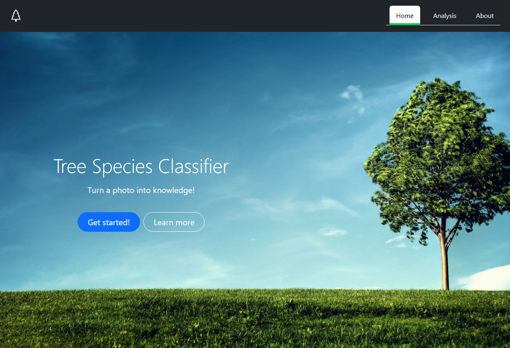
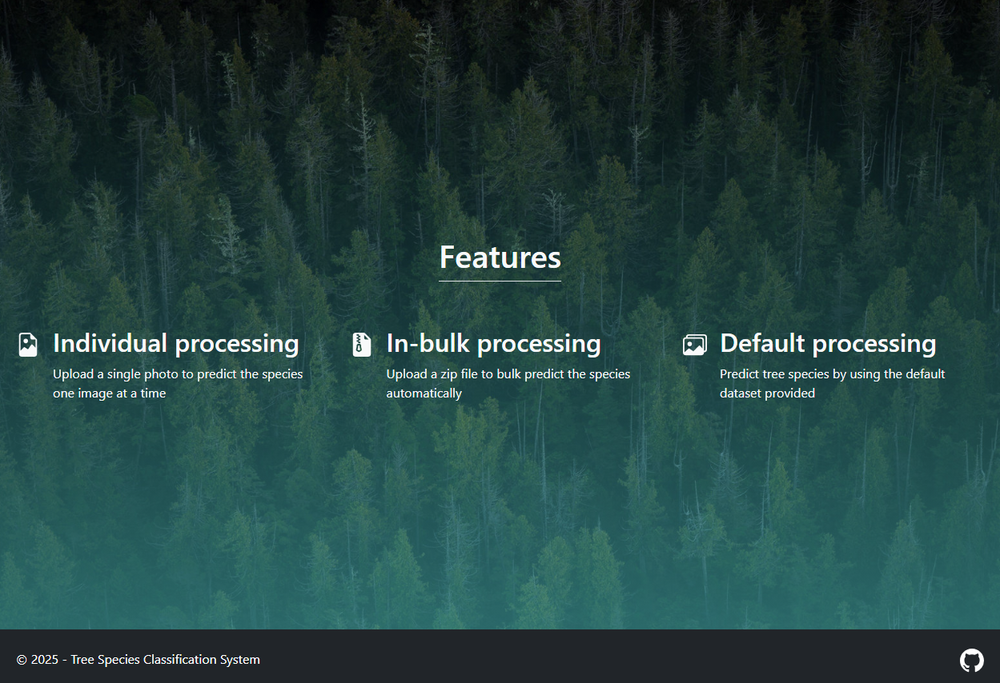
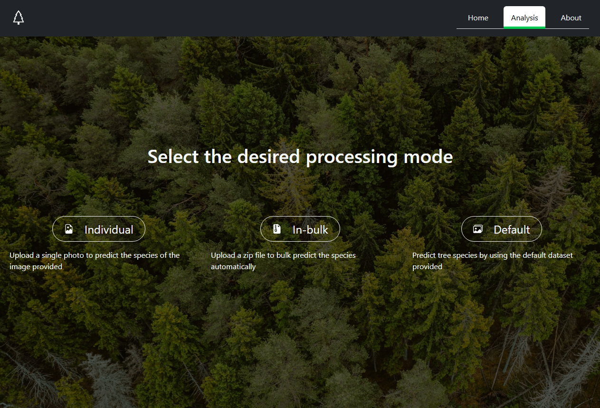
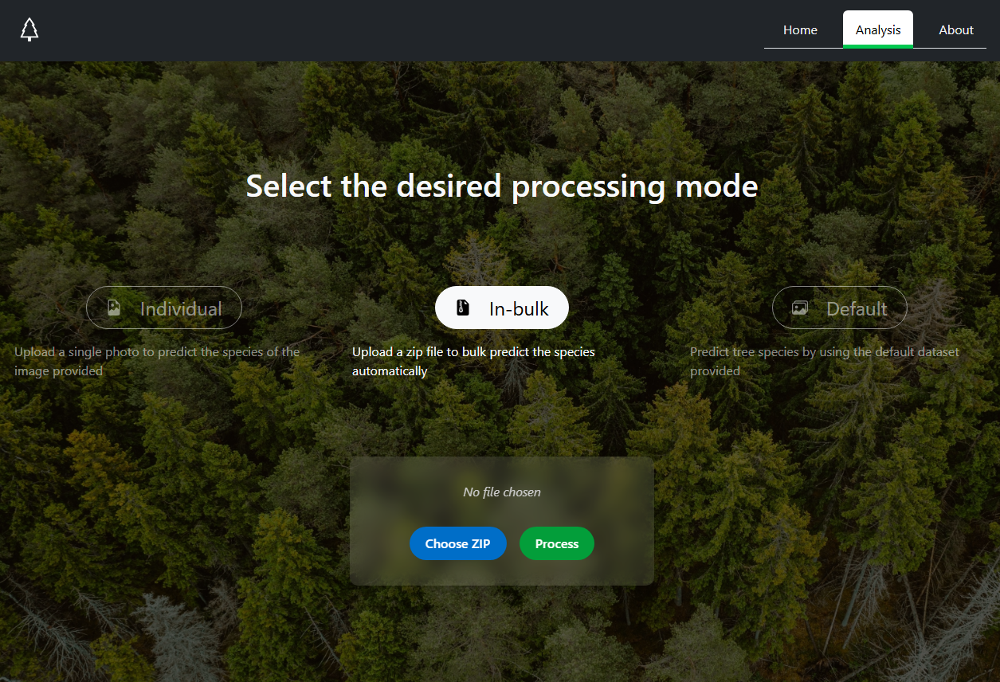
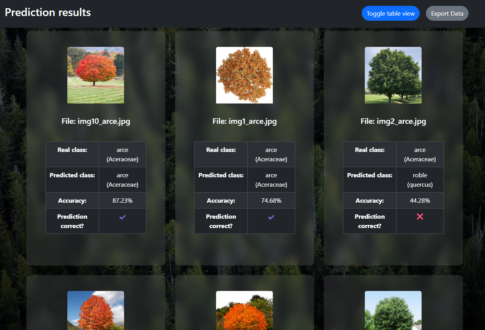
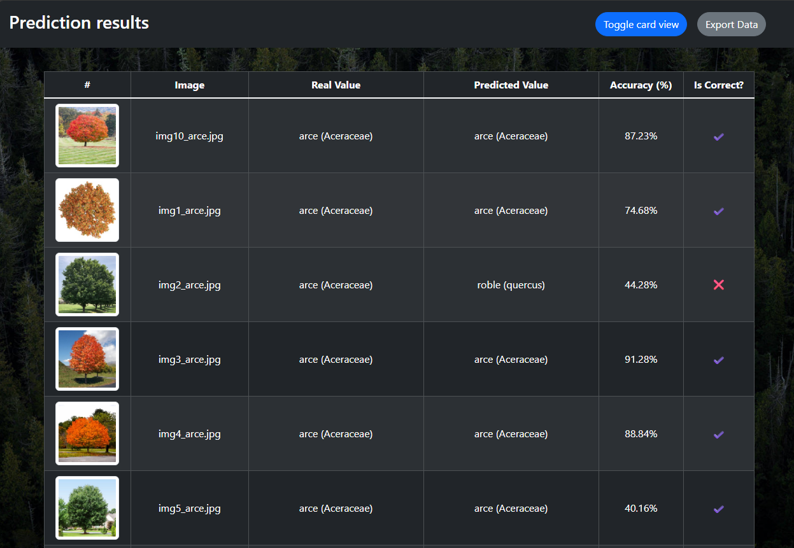
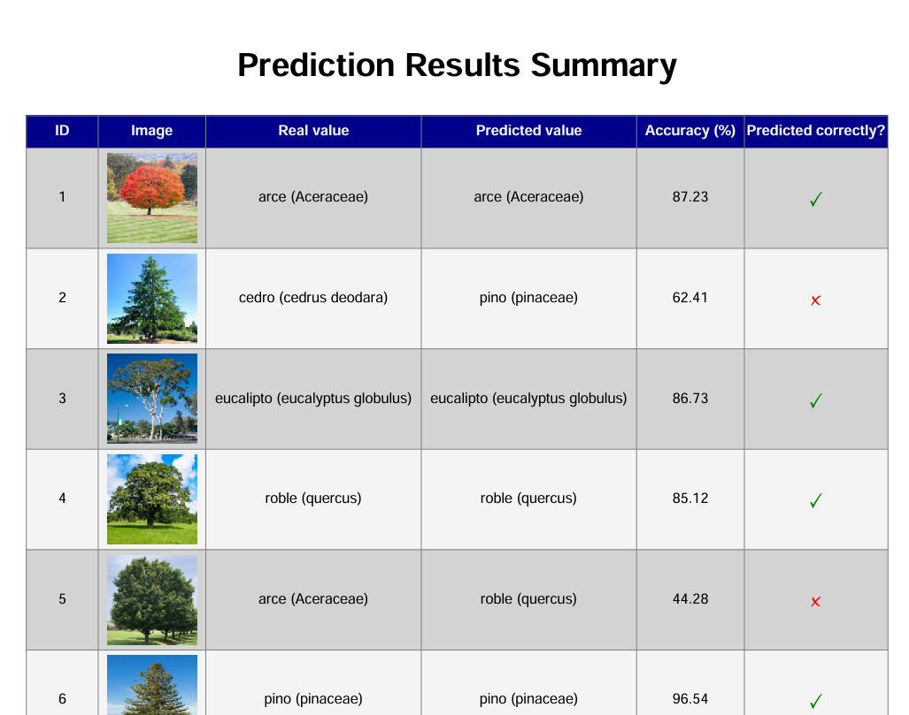
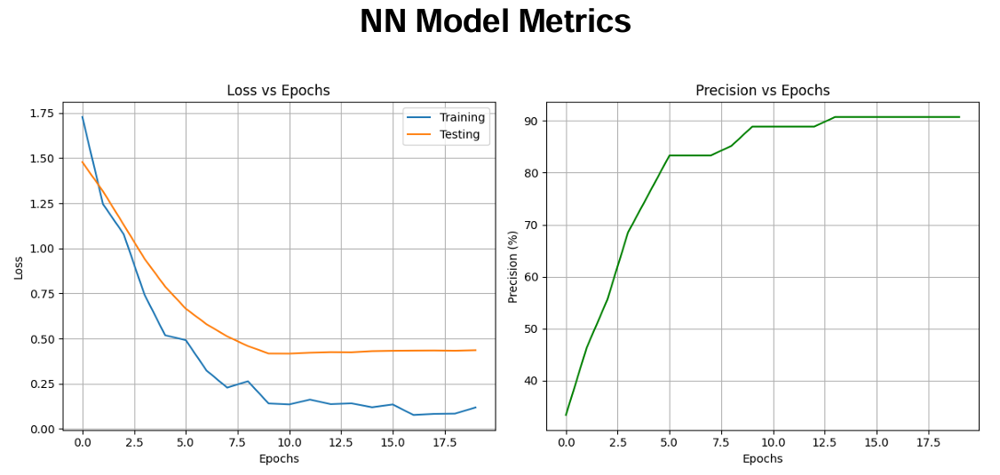
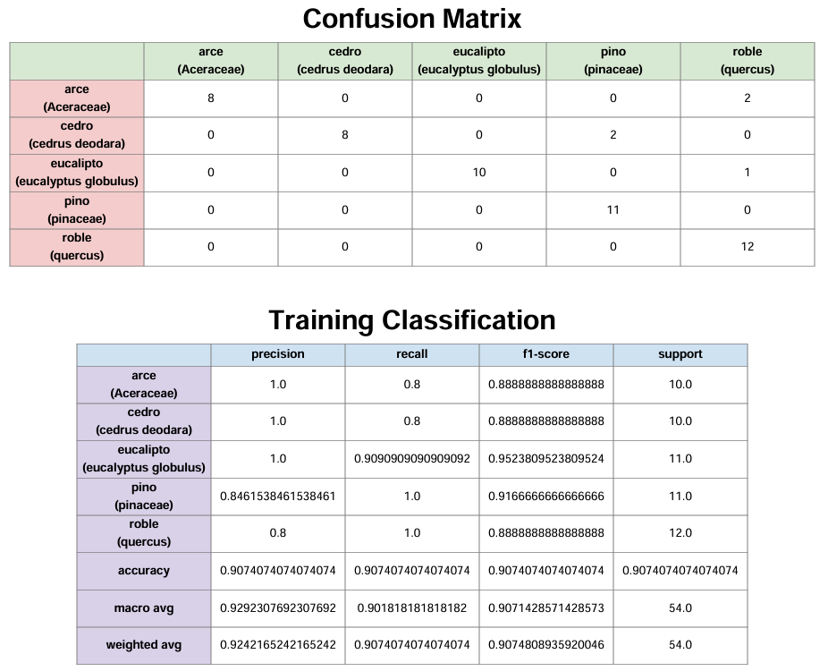
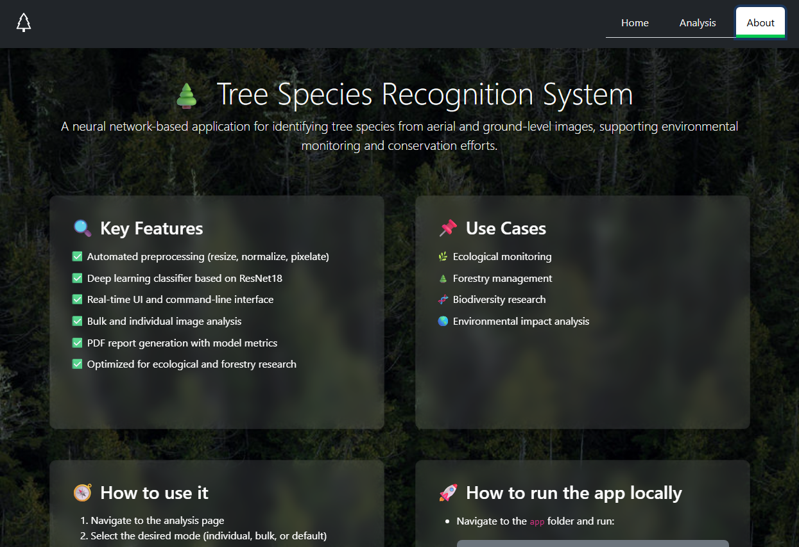

# Tree species recognition system🌲

This project is an image processing system designed to classify tree species based on aerial or ground-level images. The goal is to support environmental monitoring and conservation efforts by providing a fast, scalable, and accurate solution for automatic tree species identification.

The system utilizes deep learning techniques, specifically a convolutional neural network based on the ResNet18 architecture, to analyze images of tree canopies. The project includes a full preprocessing pipeline (resizing, normalization, pixelation, etc.), a training and evaluation framework using PyTorch, a graphical user interface for data visualization and a reporting module for exporting classification results.

<br>

## Content

- [Key Features](#key-features)
- [Use Cases](#use-cases)
- [Technologies Used](#technologies-used)
- [Project Structure](#project-structure)
- [How To Use It](#how-to-use-it)
    - [UI](#ui)
    - [CLI](#cli)
- [To Do](#to-do)

<br>

## Key Features 
- **Automated preprocessing:** Images are resized, normalized, and prepared for model input using OpenCV and PyTorch.

- **Custom dataset handling:** Support for structured class folders and data labeling.

- **Deep learning model:** A ResNet18-based neural network is used for high-performance image classification.

- **Reporting and visualization:** Tools for generating PDF reports (via ReportLab) and rendering classification results in the UI with Flask.

- **Scalability:** Lightweight design with support for default, individual and batch processing.

- **Environmental focus:** Supports low-resource execution and sustainable computing practices.

<br>

## Use Cases 
- Ecological monitoring
- Forestry management
- Biodiversity research
- Environmental impact analysis


<br>

## Technologies Used 

This project uses a variety of tools across web development, image processing, data handling and machine learning.


### Web Development

| Library     | Description                                                                    |
|-------------|--------------------------------------------------------------------------------|
| **Flask**   | Lightweight Python web framework for building APIs and web applications.       |
| **Werkzeug**| Utility library used with Flask, provides secure filename handling and more.   |


### Image Processing

| Library        | Description                                                                    |
|----------------|--------------------------------------------------------------------------------|
| **OpenCV**     | Library for computer vision and real-time image processing.                    |
| **NumPy**      | Core library for numerical operations and array manipulation.                  |


### File and System Handling

| Library     | Description                                                                    |
|-------------|--------------------------------------------------------------------------------|
| **shutil**  | High-level file operations (copy, move, delete, etc.).                         |
| **zipfile** | Tools for compressing and extracting ZIP files.                                |
| **os**      | Interfaces with the operating system for file paths, directories, etc.         |
| **io**      | Manages input/output streams, including in-memory file operations.             |


### Data Processing and Report Generation

| Library      | Description                                                                    |
|--------------|--------------------------------------------------------------------------------|
| **pandas**   | Powerful data analysis and manipulation library (DataFrames).                  |
| **reportlab**| PDF generation library for creating dynamic documents programmatically.        |

### Machine Learning and Deep Learning

| Library         | Description                                                                   |
|-----------------|-------------------------------------------------------------------------------|
| **PyTorch**     | Framework for deep learning model construction, training, and inference.      |
| **torchvision** | Utilities for image datasets and pre-trained models (e.g., ResNet18).         |
| **Matplotlib**  | Visualization library for plotting data and model performance.                |
| **scikit-learn**| Used for model evaluation (`classification_report`, `confusion_matrix`).      |


### Utilities and Others

| Library     | Description                                                                   |
|-------------|-------------------------------------------------------------------------------|
| **argparse**| Parses command-line arguments in Python scripts.                              |
| **tabulate**| Formats data in readable tabular format for console output.                   |
| **json**    | Handles reading and writing JSON-formatted data.                              |
| **csv**     | For working with CSV (Comma-Separated Values) files.                          |
| **datetime**| Provides date and time manipulation functionality.                            |

<br><br>


## Project Structure 

```bash
app/
├── main.py                             # CLI execution file (handles dataset creation and classification
├── app.py                              # App entry point file (handles UI, backend, dataset creation, classification and report generation
├── preprocessing/                      # Preprocessing and dataset management modules
│   ├── dataset/                        # Default source images organized by class
│   ├── datasetBulk/                    # Optional test input folder for batch processing
│   └── preprocessImages.py             # Image processing functions (resize, pixelate, etc.)
├── nn/                                 # Neural network modules
│   ├── outputModel/                    # Stores model training and testing classification results
│       ├── test/                       # Stores classification results 
│       └── train/                      # Stores model training metrics 
│   ├── resnet_NN_train.py              # Neural network module with training functions
│   ├── resnet_NN_test.py               # Neural network module with testing functions
│   └── resnet_NN_randomAccuracy.py     # Neural network module with randomAccuracy (not being in use)
├── UI/                                 # Neural network modules
│   ├── static/                         # Stores static UI files
│       ├── css/                        # Stores styles
│          └── styles.css
│       ├── images/                     # Stores images
│       ├── js/                         # Stores js to interact with the DOM
│          └── main.js
│   ├── templates/                      # Stores UI html templates
│       └── index.html                  
├── forReference/                       # Neural network modules created as a reference
│   ├── baseNN/                         # Stores simple NN model training and testing reference functions
│       ├── base_NN_test.py 
│       └── base_NN_train.py 
│   ├── resnetNN/                       # Stores resnet NN model training and testing reference functions
│       ├── resnet_NN_test.py 
│       └── resnet_NN_train.py 
```
<br><br>

## How To Use It

### UI

The application offers the user a home page in which it can decide whether to start classifying images or learn more about the product.

### **Home page**





<br>

### **Analysis page**

In this page, the user can decide to do a single, bulk or default classification by clicking in the corresponding button and then, a form will appear asking for the files needed (single or bulk processing) or a button to start the default dataset analysis.






<br>

### **Results page**

Here, the user can see the analysis results. It can toggle between a card-grid style or a table-like style. 





<br>

Also, a PDF report with the analysis results and the NN model metrics can be generated here as well.







<br>

### **About page**

Here, the user can learn more about the product, what it does and how to use it properly.



<br><br>


> [!NOTE]  
> To run the application locally use the command `python app.py` within the app folder. That will load the application backend, serve the frontend files and handle the single, bulk and default dataset classification and report generation

<br>


### CLI
- **To get info on how to use it:**

    ```bash
    python main.py -h
    ```

- **To create and test with the default dataset:**

    ```bash
    python main.py -c
    ```

- **To test with an image path for individual processing:**
    ```bash
    python main.py -p '<image_path>'
    ```

- **To test with a folder path for bulk image processing:**
    ```bash
    python main.py -b '<dir_path>'
    ```
<br>

> [!IMPORTANT]  
> For individual or bulk processing, the input files should follow the convention: ```<name>_<treeSpecies>.<file_extension>```
<br><br> 
> For example: <code>img9_oak.jpg</code>

<br><br>

## To Do

- Add a script to install all the dependencies required automatically
- Migrate to a frontend framework for easier state handling, routing and interaction
- Rename default dataset classes to translate it to English (have to change NN train and test functions accordingly)
- Refactor code
- Use smoother animation, components and styles
- Reuse components like navbar, footer, etc

